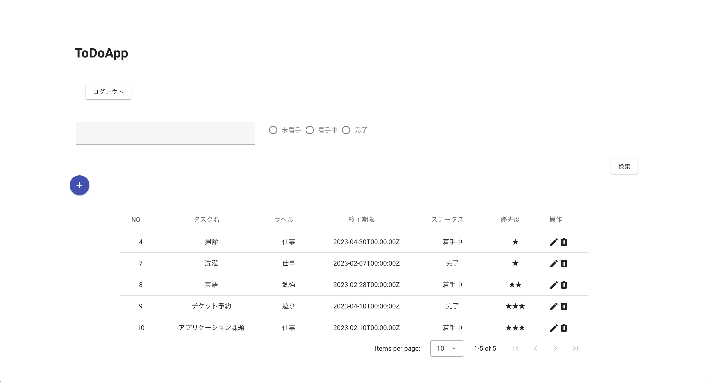
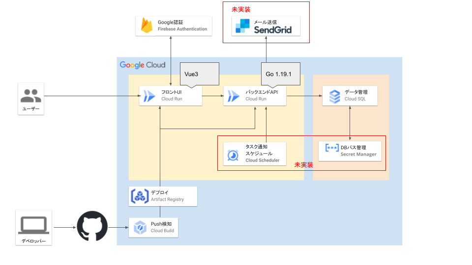
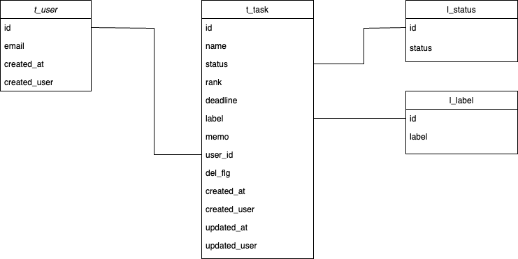

# アプリケーション構築課題
本リポジトリは、クラウドエース株式会社のアプリケーション構築課題のソースコードを格納するものです。

## 画面イメージ


## システム構成図


## api仕様書
[api仕様書](api/api_compose.yml)

## ER図


## 技術スタック
- Golang 1.19
- Gorilla mux
- Firebase Authentication
- Vue3
- Vuetify3
- CloudRun
- CloudSQL for Postgres
- Docker

## ディレクトリ構成
/api にバックエンド、/web にフロントエンドソースコードを格納しています。

## バックエンドについて  
クリーンアーキテクチャを意識して実装しました。  
『依存関係の分離』を実現するため以下の構成を取っています。  
（以下、太字は /api/todos/pkg のディレクトリを示す）
- Enterprise Business Rules  
**/domain** ... APIでやりとりするデータ構造を定義
- Application Business Rules  
**/usecase** ... **/domain**で定義したデータ構造の取り扱いルールを定義
- Interface Adapters  
**/interface** ... こちらは実装途中です。が、現状は以下のように理解しています。  
  - **/usecase**と **/adapter** または **/infra**との橋渡しを行う。
  - 「あるべき姿」は以下のようになる。
    - ＜現状＞ 
      - **/adapter/handler.go**→ **/usecase/interactor.go**→ **/infra/db_connector.go**
    - <理想>
      - **/adapter/handler.go**→ （ **/interface**で/usecaseを呼び出し）→**/usecase/interactor.go**→ （ **/interface**でクエリ整形）→**/infra/db_connector.go**→（ **/interface**で返却値を生成）
- Frameworks & Drivers   
**/adapter** ... ルーティングフレームワークに依存する処理を記述  
**/infra** ... DBに依存する処理を記述  

参考：  
https://zenn.dev/tis1116/articles/6c5416e5d77dbf
https://blog.tai2.net/the_clean_architecture.html

## インフラについて
- CI/CD
  - devリポジトリにpushされると、CloudRunにデプロイされるよう構成。
- CloudRun
  - フロントエンド(todo-api)とバックエンド(tado-web)で構成。
- ローカル環境
  - docker-compose.ymlで管理。
  - 前提条件：サービスアカウントキーを付与されていること。
  - 手順：  
    以下のコマンドを実行する  
    ```docker-compose up --build -d```
    
## 振り返り
約１ヶ月本課題に向き合い、非常に充実した期間になりました。  
一方で、キャッチアップに時間がかかり達成できなかった課題もあります。  
以下に習得したこと＆時間の都合上できなかったことを振り返ってみます。  
#### 習得したこと
- クリーンアーキテクチャなど、設計思想に則した実装ができた。
- Golangを使った基本的なCRUD操作ができた。
- Gitの実践的な使い方を学ぶことができた。
#### できなかったこと
- アラート通知機能
- パスワード等のSecretManager管理
- CloudRunへのフロントアプリのビルド
  - パッケージの依存関係の解消ができていないようなエラーが出ます。が、解決に至っていないです。
#### もし、もう一度やるなら
今回、設計思想の理解（体験）が自分にとってのメインテーマでした。  
またGitを実務で使用したことがなく、これらのツールの習得も重要でした。  

上記を習得した今、もう一度本課題をやるとすれば・・  
**GCPリソースを潤沢に使ってみたい** と、そう思います。 

だって折角クラウドエースに入社したんですから。  
やり残した課題の消化も含め、より多くのリソースを試していれば、より充実した研修体験になったのかなぁというのが今の感想です。  
この想いは今後の業務や学習に投じていきたいと考えています。  

*To be continued ...*
